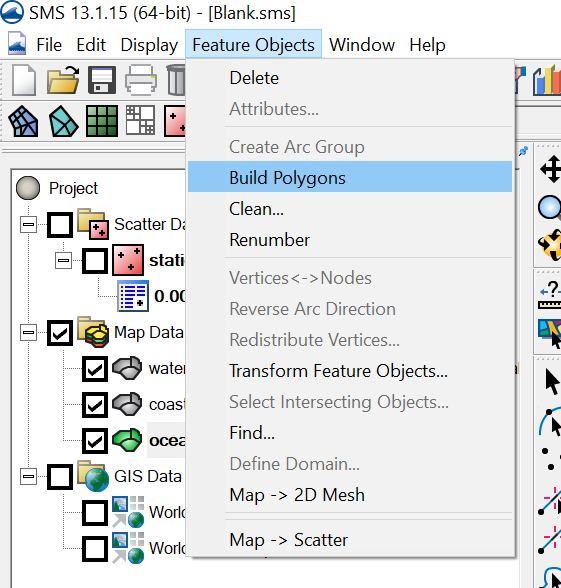
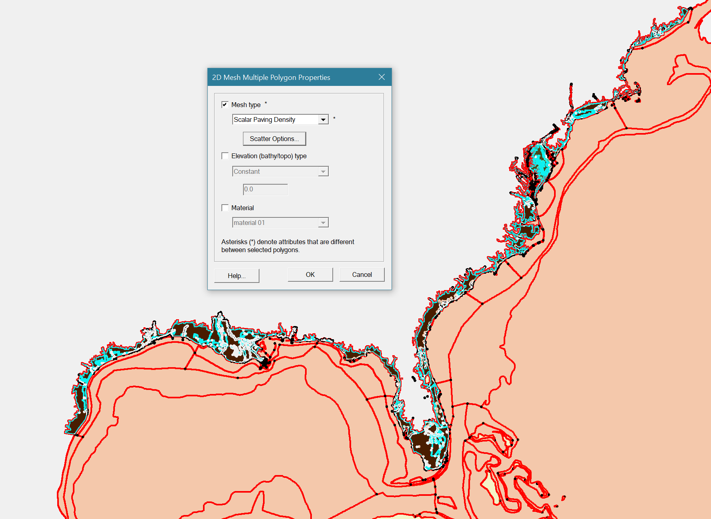
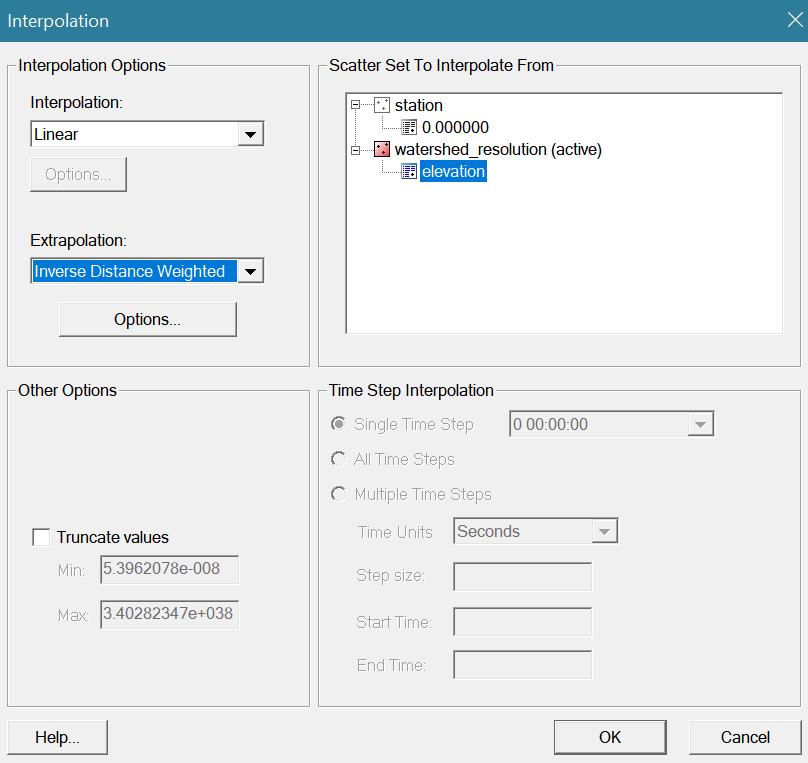

## **Preparation**
Typically, you should have the following items in an SMS project:

 

For a complex meshing project, it is imperative to keep different features in seperate maps.
Merging individual maps should be done as the last step.

The purpose of each SMS project component is as follows:

- Scatter Data:

    - station: Mark locations where mesh quality is important; at least make sure none of the observational stations is in land cells.

    - <a name="watershed_resolution">watershed resolution</a>: Used for setting "scalar density paving" on some polygons, see details [here]().

- Map Data:

    - <a name="select">select\*</a>: A map containing a polygon that intersects with all polygons where the "scalar density paving" attribute is needed, see details [here]().
                This is useful when the number of watershed polygons is too large to select manually.
                The polygon can be made in Qgis by first extracting the grid boundary then simplifying its geometry (otherwise the polygon is too complex for efficient selection of intersecting features).

    - lbnd: land boundary roughly along the 10-m contour, see [caveats of making the land boundary]().

    - \*levee\*: Levees from National Levee Database.

    - auto\*arcs: Automatically generated river arcs.

    - coast: This map includes all manually made polygons (including quad patches) and the coastline.

    - ocean: This map includes everything beyond the coastline and in the ocean.

    - <a name="divide">divide</a>: A few manually drawn arcs that divide the coastal regions into subregions.
              This makes the mesh generation of complex maps more robust in SMS.
              This is also useful for locating SMS issues because you can mesh different subregions in seperate SMS sessions simultaneously, which speeds up the diagnosis of SMS exceptions (crashing or hanging) that may occur for a complex map, see details [below](#find-and-fix-sms-issues).

    - merge coverge: Merged map of all individual maps above.

- Gis Data:

    - World imagery and NWM segments: These provide a guidance on watershed and river topography, which helps avoid meshing errors during the desgin phase (e.g., when editing the [land boundary]())  

!!! Attention
    Never edit the merged map directly, unless you are willing to take the time to exactly reproduce the changes in all individual maps (which is more time consuming in most cases, so don't do it).
    Unsyncing the merged map with the individual maps make it practically impossible for any significant changes in the future.
    The only case in which editing the merged map may be beneficial is when you work on a huge map (with tens of thousands of arcs) and cleaning the merged map takes much time (e.g. hours).
    In this case, make sure the changes are also reproduced in individual maps.


## **Clean the merged map**

Clean the merged map twice with the following parameters: 


Two cleans are needed because the second clean will snap some of the newly created points during the first clean.


## **Build polygons**




## **Set watershed resolution**
To avoid over-refinement, most watershed polygons should have a specified mesh resolution, which can be set via the "scalar paving density" option in each polygon's attributes.

Selecting the watershed polygons may involve much labor because many small polygons are generated after the river arcs are merged into the final map.
Instead of manual selection, use the ["select\*" map coverage](#select) to select all polygons more efficiently.

Activate the "select\*" coverage:


Select the big polygon, right click on it, and click "Select intersecting objects":


Intersect it with "merge coverage" with the following parameters:


It will take about 10 minutes to do the selection for the STOFS3D domain.
Right click on the selected polygons and set "mesh type" in "polygon attributes" to scalar paving density: 



Set scalar options using the [watershed_resolution](#watershed_resolution) scatter dataset from the [preparation](#preparation) step:



In addition, set the polygon attribute of the "island" between Chesapeake Bay and Delaware Bay as "None":


##**Find and avoid SMS issues**
There are some known issues in SMS that may hang or crash a large scale mesh project
(e.g., the US east coast and Gulf coast domain of STOFS-3D-Atlantic; smaller domains with 1 or 2 states have less problems).
We have reported them to the SMS team and most of them will be fixed when the next SMS version is released.

The issues include:

- SMS may hang while generating mesh for a complex polygon.
Breaking the large polygon into smaller and simpler polygons can help fix the issue.


- "Void in breakline" in some polygons. Slightly moving some vertices may fix the problem.


If SMS hangs, copy down the polygon ID (found in the lower-left corner) and restart the session. 
 Note that occasionally the real problematic polygon may be the next one from 'ID'.

Before these issues are officially fixed, you may consider the following steps (Using STOFS3D Atlantic as an example)
to find and avoid them before the final meshing.

Option 1 (More manual work but takes less time):

Break the merged map into sub-maps along the [division lines](#divide).
Make sure there are no overlaps among the sub-maps except for the interface line:


Mesh each sub-map in a seperate SMS session and fix issues when they occur using the methods discussed earlier,
then combine the sub-meshes in SMS or using the following script in [SCHISM Git]():
```
$your_schism_dir/schism/src/Utility/Grid_Scripts/mergegrid5.f90
```

Option 2 (Less manual work but takes more time):

In each SMS session, select the polygons within a sub-domain and try to generate a sub-domain mesh with the selected polygons only.
Normally, there won't be any "hanging" issues, but there can be 5 - 8 "breakline" issues in total and SMS will prompt for the IDs of the problematic polygons.
Open another SMS session and fix all issues in the merged map.
Here, editing the merged map is unavoidable because the issues originates from the merging step.
Finally, generate the mesh for the full domain.
This takes about 3-5 hours, depending on how fast your desktop is.


## **Finalize the mesh**
Delete the disjoint nodes:


Renumber nodes:


Save the mesh as \*.2dm:


## ** Mesh quality and skew elements **
Although the script tries to optimize the convergence of river arcs at river intersections
, skew elements may occasionally occur.


It is recommended to just leave them be, because these small 'bad' elements do not affect the quality, efficiency, or stableness of SCHISM simulations.

If you think it is necessary, you may remedy them using the following script provided in [SCHISM Git]():
```
$your_schism_dir/schism/src/Utility/Grid_Scripts/Compound_flooding/RiverMapper/RiverMapper/improve_hgrid.py
```
The script automatically checks for small and skew elements,
then improve the mesh either by removing the problematic elements or local relaxation.

